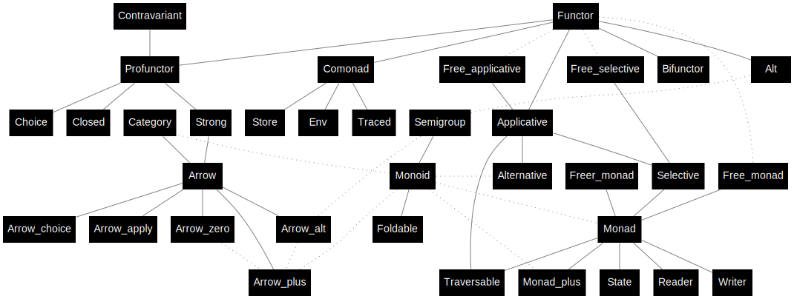

% **[Preface](https://github.com/xvw/preface/)**, an opiniated library \newline for *functional programming* in OCaml
% **Okiwi** - April 2021
% [D. Plaindoux](https://github.com/d-plaindoux) - [P. Ruyter](https://github.com/gr-im) - [**X. Van de Woestyne**](https://github.com/xvw)

## Plan

- What is **Preface**

- Why it was designed

- Some design choices

- A note about effect handlers

- Conclusion

# What is Preface
## What is Preface

> Preface is an **opinionated** library designed to facilitate the
> handling of recurring **functional programming idioms** in
> **OCaml**. Many of the design decisions were made in an attempt to
> calibrate, as best as possible, to the OCaml language. Trying to get
> the most out of the module language. *The name "preface" is a nod to
> "Prelude"*.

## What is Preface

- [Github repo](https://github.com/xvw/preface) -
  *https://github.com/xvw/preface*
- [Documentation](https://ocaml-preface.github.io/preface/index.html) -
  *https://ocaml-preface.github.io/preface/index.html*
- ~**500** commits
- ~**2** years on our free time
- **3 major contributors**, 1 additional contributor
- ~**35** abstractions
- ~**20** implementations

## 

## With the help of 

- **Gabriel Scherer**: early draft of the *modular breakdown*
- **Andrey Mokhov**:  *Applicative Selective Functor*
- **Florian Angeletti**: tricky quantification
- **Oleg Kiselyov**: advices about *Freer Monad*
- **XHTMLBoy**: fixing *Freer monad*, *Free Applicative* and *Free Selective*
- **Pierre-Evariste Dagand**: help with Arrows

# Why it was designed
## An *almost* true story

- You find a nice article that elegantly implements a boring problem \pause
- The article is obviously in Haskell \pause
- You are an OCaml programmer (and you don't want fight with Cabal) \pause
- You try to implement it \pause
- Nice, you can implement `>>=` easily \pause
- **Damn**, the article relay on typeclasses...
- You give up. \pause

### Except if you use Preface!

With **Preface**, a lot of the machinery is derivable, relying on
modules instead of typeclasses.

## More seriously

- In OCaml, common functional abstraction (like Monad or Applicative)
  are buried in the heart of certain libraries/projects:
  - Lwt (Monad)
  - Cmdliner (Applicative)
  - Dune (Selective)
  - Bonsai (Arrow)\pause

- When Didier and I were starting new projects, we often **copied and
  pasted code** that had already been written (capturing those
  abstraction).\pause
  
- So we decided to pool our efforts to have a basis for each new
  project

# Some design choices

## Some design choices

> Even our goal was to **fit on the semantic of OCaml**, Haskell was a
> great source of inspiration.

## Difficulties from Haskell translation

- Lack of typeclasses (which introduces the **modular breakdown**)
- Higher Kinded polymorphism only allowed in module language
- No partial application on kind (ie: `Either a b` can't be treated as
  `Either a`)

# Modular Breakdown 

## Preface is cutting in 4 modules

- `Core`: Helpers 
- `Specs`: type description
- `Make`: Functor (in *ml sense*) taking interfaces defined in `Specs` and producing modules constrained by `Specs`
- `Stdlib`: some concrete implementation

# Modular breakdown from \newline  https://github.com/xvw/preface/blob/master/guides

# Specialization of type with different arities \newline  (ie: `Either a b` can't be treated as `Either a`)

# Translating Typeclasses constraints into first class modules or functor (see `Foldable` and `Store`)

# A side note on effect system

# Conclusion
